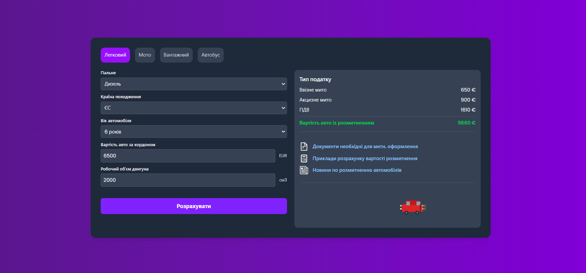

Customs Clearance Calculator

Web application for calculating the cost of vehicle customs clearance in Ukraine.
The project is built with React and Vite and provides an interactive interface for tax calculation.

Overview

This application allows users to estimate the total customs clearance cost of a vehicle based on selected parameters.
It includes tax calculation logic, structured components, and client-side routing.

Features

Vehicle price input

Engine type selection

Automatic customs duty calculation

Excise tax calculation

VAT calculation

Final cost summary

Multi-page navigation

Responsive UI

Tech Stack

React

Vite

React Router DOM

TailwindCSS

JavaScript (ES6+)

Node.js / npm

Installation

Clone the repository:

git clone https://github.com/ilchyshynNazar/auto-customs-calculator.git
cd customs-clearance-calculator

Install dependencies:

npm install

Running the Project
npm run dev

The development server will start locally.

Screenshots

Add screenshots to the assets folder and reference them like this:

### Home Page

### Calculation Result
