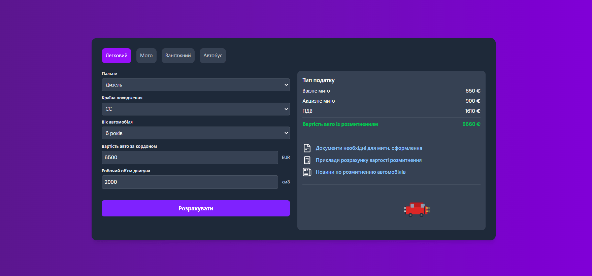

# Customs Clearance Calculator

[](https://github.com/ilchyshynNazar/auto-customs-calculator/actions/workflows/ci-cd.yml)

## Live Demo
[Перейти на сайт](https://auto-customs-calculatorfinall.vercel.app/)

---

## Overview
Web application for calculating the cost of vehicle customs clearance in Ukraine.  
The project is built with **React** and **Vite**, and provides an interactive interface for tax calculation.

This application allows users to estimate the total customs clearance cost of a vehicle based on selected parameters.  
It includes tax calculation logic, structured components, and client-side routing.

---

## Features
- Vehicle price input  
- Engine/fuel type selection  
- Automatic customs duty calculation  
- Excise tax calculation  
- VAT calculation  
- Final cost summary  
- Multi-page navigation  
- Responsive UI  

---

## Tech Stack
- React  
- Vite  
- React Router DOM  
- TailwindCSS  
- JavaScript (ES6+)  
- Node.js / npm  

---

## Installation
Clone the repository:

```bash
git clone https://github.com/ilchyshynNazar/auto-customs-calculator.git
cd auto-customs-calculator
```

Install dependencies:

```bash
npm install
```

---

## Running the Project
Start the development server:

```bash
npm run dev
```

The development server will start locally. Navigate to `http://localhost:5173`.

---

## Screenshots

### Home Page


### Calculation Result

